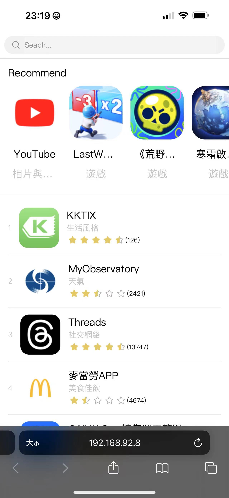
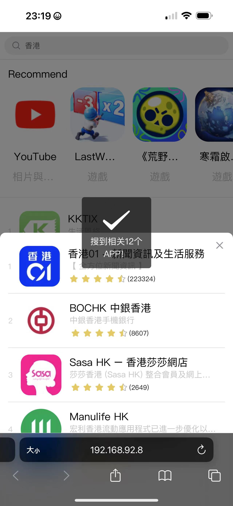
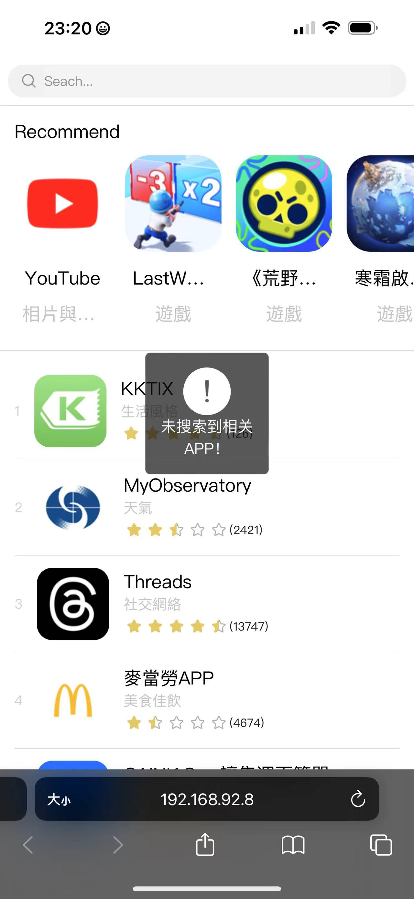
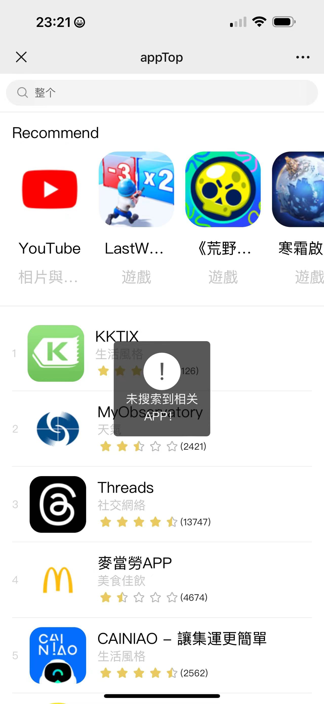
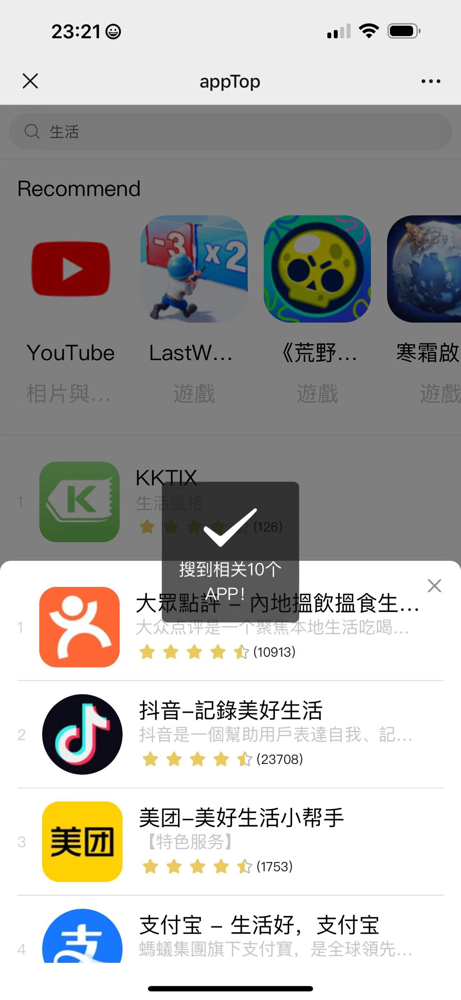
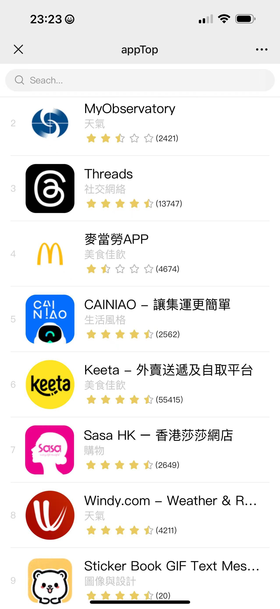

# apptop

## 介绍

`apptop` 是基于 `uni-app` 实现的移动端应用，主要功能是展示一些常用的手机应用。

## 拉取代码
```
git clone https://github.com/mugege163/appTop.git
```

## 开发环境
- 开发环境：node:18+ | npm
- 开发工具：HBuilderX | vsCode
- 开发语言：Vue


## 安装 依赖

在项目根目录执行该命令安装依赖
```
npm install
```
## 运行项目

在项目根目录执行该命令运行到 h5 端
```
npm run serve
```
## 打包构建项目

在项目根目录执行该命令进行打包项目到dist目录
```
npm run build
```


## 自动测试用例

在项目根目录执行该命令进行测试
```
npm run test:h5
```
## 线上展示

## 这里是示例图片：


手机浏览器运行
`````````





手机微信网页运行
`````````





